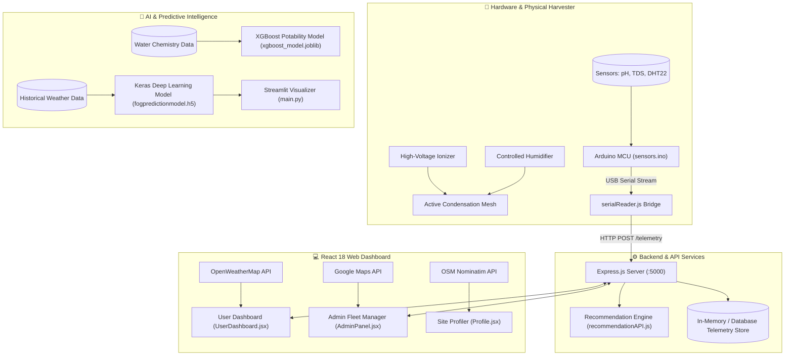
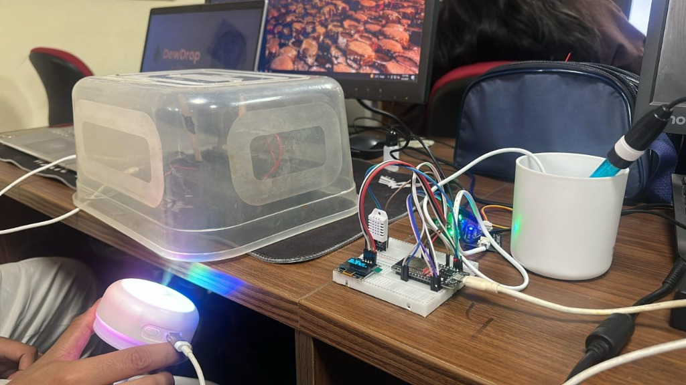

<div align="center">

# 🌫️ DewDrop — Sip the Sky

### *Next-Generation Electrostatic Atmospheric Water Harvesting & Intelligent IoT Management*

[](LICENSE)
[](LICENSE)
[](https://reactjs.org/)
[](https://vitejs.dev/)
[](https://tailwindcss.com/)
[](https://nodejs.org/)
[](https://expressjs.com/)
[](https://www.tensorflow.org/)
[](https://xgboost.readthedocs.io/)
[](https://www.arduino.cc/)

<br />

<p align="center">
  <b>Transforming dense atmospheric fog into safe, mineral-rich drinking water with active electrostatic attraction, embedded IoT sensors, and machine-learning intelligence.</b>
</p>


---

</div>

> [!NOTE]
> ### 📌 Project Origin & GitHub Showcase Notice
> **Note:** I originally designed and built this project earlier with my team as an end-to-end CleanTech hardware, IoT, and AI initiative, but had not uploaded it to my GitHub until now. I am now publishing this repository to showcase the research, system architecture, hardware schematics, machine learning models, and full-stack web dashboard for peer review and portfolio demonstration.

---

## 📖 Table of Contents

- [The Challenge](#-the-challenge)
- [The DewDrop Solution](#-the-dewdrop-solution)
- [Key Features](#-key-features)
- [System Architecture](#-system-architecture)
- [Hardware & Embedded Telemetry](#-hardware--embedded-telemetry)
- [Machine Learning & Predictive Intelligence](#-machine-learning--predictive-intelligence)
- [Web Platform & Dashboards](#-web-platform--dashboards)
- [Tech Stack](#-tech-stack)
- [Repository Structure](#-repository-structure)
- [Getting Started](#-getting-started)
  - [Prerequisites](#prerequisites)
  - [1. Frontend Web App](#1-frontend-web-app)
  - [2. Node.js Backend Server](#2-nodejs-backend-server)
  - [3. Python Machine Learning Suite](#3-python-machine-learning-suite)
  - [4. Embedded Hardware Setup](#4-embedded-hardware-setup)
- [Commercial & Municipal Applications](#-commercial--municipal-applications)
- [Roadmap](#-roadmap)
- [Intellectual Property & Patent Notice](#️-intellectual-property--patent-notice)

---

## 🌍 The Challenge

- **Over 1.1 billion people** face severe water scarcity worldwide, particularly across arid coastal regions that paradoxically experience frequent, dense fog.
- **Traditional Fog Collectors rely on passive raschel mesh nets**, which suffer from poor aerodynamic efficiency (**~1–2% capture rate**). As wind approaches passive nets, streamlines curve around the mesh fibers, carrying suspended micro-droplets away before condensation can occur.
- Previous academic and commercial attempts focused merely on chemical coatings or weave patterns without altering the fundamental aerodynamics or droplet physics.

---

## 💡 The DewDrop Solution

**DewDrop** shifts the paradigm from *passive mesh interception* to **active electrostatic attraction and intelligent IoT microclimate orchestration**:

1. **Ionized Droplet Attraction:** High-voltage static electric fields induce an electric charge on incoming microscopic fog droplets ($1\text{--}40\,\mu\text{m}$), actively pulling them toward grounded condensation collectors rather than allowing them to bypass in the air current.
2. **Up to 10× Efficiency Gain:** Generates dramatic capture yields compared to passive nets, targeting operational condensation efficiencies of **up to 90%** in dense fog conditions.
3. **Continuous Water Quality Validation:** Onboard analytical sensors monitor pH and Total Dissolved Solids (TDS) in real-time, verifying whether harvested water is ready for direct consumption or secondary treatment.
4. **AI-Driven Forecasting:** Machine learning models predict fog density curves and harvest yields hours in advance based on ambient meteorological variables.

---

## 🚀 Key Features

- **⚡ Active Electrostatic Harvesting:** Controlled high-voltage ionization module to supercharge droplet coalescence and condensation velocity.
- **🔬 Real-Time Analytical Sensor Suite:**
  - **pH Electrode Sensor:** Continuous acidity/alkalinity tracking ($0\text{--}14$ pH).
  - **TDS Sensor:** Total dissolved solids monitoring ($0\text{--}1000+$ ppm) to evaluate water purity.
  - **DHT22 / DHT11 Sensor:** Microclimate relative humidity and temperature capture.
- **🧠 Dual Machine Learning Pipelines:**
  - **Fog Density Neural Network (`fogpredictionmodel.h5`):** Deep Learning regression model forecasting fog density ($\text{g/m}^3$) to pinpoint peak harvesting windows.
  - **Water Potability Classifier (`xgboost_model.joblib`):** 9-parameter XGBoost classifier verifying potability and safety compliance.
- **🖥️ Full-Featured Web Application:**
  - **User Dashboard:** Live telemetry widgets, water production rate gauges, weather forecasts, and historical analytics.
  - **Admin Fleet Management:** Multi-device monitoring, interactive map clusters via Google Maps API, and device operation toggles.
  - **Rooftop & Site Profiler:** Calculates projected water yield based on square footage, roof pitch, material properties, and local coordinates using OpenStreetMap reverse geocoding.
- **🌦️ OpenWeatherMap API Integration:** Real-time localized weather data syncing every 10 minutes with automated fallback handling.

---

## 🏗️ System Architecture



---

## 🔌 Hardware & Embedded Telemetry

<div align="center">
  
  <p align="center"><sub><b>Figure:</b> Physical laboratory testing rig — ultrasonic mist generator feeding the condensation chamber, breadboard microcontroller circuit with OLED live telemetry display, and analog pH / TDS water testing beaker.</sub></p>
</div>

The physical prototype is engineered with an embedded microcontroller (Arduino / ESP32) communicating with an integrated sensor suite:

| Component | Interface | Measurement / Role | Purpose in DewDrop |
| :--- | :--- | :--- | :--- |
| **pH Sensor & Electrode** | Analog (A0) | $0.0 - 14.0\text{ pH}$ | Verifies water safety, detects environmental acidity |
| **TDS Sensor (Total Dissolved Solids)** | Analog (A1) | $0 - 1000+\text{ ppm}$ | Measures mineral/solute concentrations in harvested water |
| **DHT11 / DHT22 Sensor** | Digital (Pin 2) | Temperature ($^\circ\text{C}$), Relative Humidity ($\%$) | Tracks microclimate conditions to trigger optimal condenser cycles |
| **High-Voltage Ionizer** | Digital Relay | Electrostatic Field Discharge | Charges incoming fog particles to accelerate capture onto mesh |
| **Ultrasonic Humidifier** | Digital Relay | Controlled moisture induction | Calibrates and stresses the condensation chamber under test scenarios |
| **Serial Telemetry Bridge** | USB / UART | 9600 Baud JSON / Comma Delimited | Streams live sensor readings from microcontroller to `serialReader.js` |

---

## 🧠 Machine Learning & Predictive Intelligence

### 1. Atmospheric Fog Density Forecaster (`fogpredictionmodel.h5`)
- **Framework:** TensorFlow / Keras (Deep Neural Network / Sequence Model)
- **Input Features:** Dew Point (`_dewptm`), Relative Humidity (`_hum`), Visibility (`_vism`), Temperature (`_tempm`), Atmospheric Pressure (`_pressurem`), Hour, Day, Month, Year.
- **Normalization:** Scikit-Learn `MinMaxScaler`.
- **Output:** Predicted instantaneous fog density ($\text{g/m}^3$), automatically pinpointing the exact peak hour for maximum water extraction.
- **Interactive UI:** Built-in Streamlit application (`python models/main.py`) with Plotly charts visualizing daily condensation yield curves.

### 2. Water Potability Classifier (`xgboost_model.joblib`)
- **Algorithm:** Extreme Gradient Boosting (XGBoost)
- **Parameters Evaluated:**
  1. pH Value
  2. Hardness
  3. Total Dissolved Solids (TDS)
  4. Chloramines
  5. Sulfate
  6. Conductivity
  7. Organic Carbon
  8. Trihalomethanes
  9. Turbidity
- **Result:** High-confidence binary classification: **Potable (Safe for Consumption)** vs. **Requires Filtration**.

---

## 💻 Web Platform & Dashboards

The web application is built on **React 18** and **Vite**, styled with **Tailwind CSS**, and architected for both individual consumers and municipal fleet operators:

| View | Key Functionalities |
| :--- | :--- |
| **User Dashboard** | Live pH & TDS gauges, harvest volume counter, active weather condition badge, collection efficiency scores, animated microclimate graphs. |
| **Admin Fleet Panel** | Google Maps fleet clustering, multi-harvester node status (Active/Offline), global water production aggregates, remote hardware kill switches. |
| **Device Diagnostics** | Granular per-device telemetry, hardware sensor calibration, serial log feeds, uptime counters. |
| **Site Profiler** | Rooftop dimensional calculator estimating yield based on surface area ($\text{m}^2$), slope, roofing material, household water demand, and GPS coordinates. |

---

## 🛠️ Tech Stack

<div align="center">

| Layer | Technologies |
| :--- | :--- |
| **Frontend UI** | React 18, Vite, Tailwind CSS, Radix UI Primitives, Lucide Icons, Recharts, Framer Motion |
| **Mapping & Location** | Google Maps JavaScript API, `@googlemaps/markerclusterer`, OpenStreetMap Nominatim |
| **Backend API** | Node.js, Express.js, CORS, Dotenv, Axios |
| **Embedded & IoT** | Arduino C++, Serialport (`@serialport/parser-readline`), High-Voltage Relay Systems |
| **Machine Learning** | Python 3.10+, TensorFlow / Keras, Scikit-Learn, XGBoost, Pandas, NumPy, Joblib |
| **Data Viz & Tooling** | Streamlit, Plotly, PostCSS, ESLint |

</div>

---

## 📁 Repository Structure

```plaintext
DewDrop/
├── assets/
│   └── hardware-prototype.jpg    # Working hardware prototype testing rig
├── hardware/
│   └── sensors/
│       ├── sensors.ino           # Arduino firmware (pH, TDS, DHT22 sampling)
│       └── serialReader.js       # Serial port bridge to Express backend
├── python models/
│   ├── fogpredictionmodel.h5    # Pretrained Keras Deep Learning model
│   ├── testset.csv              # Atmospheric training & validation dataset
│   ├── main.py                  # Streamlit application for fog analysis
│   ├── requirements.txt         # Python dependencies for fog model
│   └── water quality/
│       ├── xgboost_model.joblib # Pretrained XGBoost potability classifier
│       ├── water_potability.csv # Chemical drinking water benchmark dataset
│       ├── app.py               # Water quality evaluation runner
│       └── requirements.txt     # Python dependencies for water model
├── server/
│   ├── server.js                # Express backend entry point
│   ├── index.js                 # API endpoints & live telemetry routes
│   ├── recommendationAPI.js     # Rule & weather-based recommendation logic
│   └── package.json             # Server dependencies
├── src/
│   ├── components/              # Radix/Tailwind reusable UI components
│   ├── config/
│   │   └── weatherConfig.js     # OpenWeatherMap configuration
│   ├── pages/
│   │   ├── HomePage.jsx         # Landing page & technology overview
│   │   ├── UserDashboard.jsx    # Real-time consumer telemetry portal
│   │   ├── AdminPanel.jsx       # Municipal fleet monitoring & Google Maps
│   │   ├── DevicePage.jsx       # Granular device controls
│   │   └── Profile.jsx          # Rooftop harvest yield estimator
│   ├── App.jsx                  # React router & state providers
│   └── main.jsx                 # Client entry point
├── package.json                 # Frontend dependencies and npm scripts
├── vite.config.js               # Vite build configuration
├── tailwind.config.js           # Tailwind theme & design tokens
└── WEATHER_SETUP.md             # Detailed guide to setting up OpenWeatherMap API
```

---

## ⚡ Getting Started

### Prerequisites

- [Node.js](https://nodejs.org/) (v18.0.0 or higher) & `npm`
- [Python](https://www.python.org/) (v3.9 - v3.11 recommended)
- [Arduino IDE](https://www.arduino.cc/en/software) (for physical hardware flashing)
- Free [OpenWeatherMap API Key](https://openweathermap.org/api)

---

### 1. Frontend Web App

1. Install root dependencies:
   ```bash
   npm install
   ```

2. Configure your OpenWeatherMap key in `src/config/weatherConfig.js`:
   ```javascript
   export const WEATHER_CONFIG = {
     WEATHER_API_KEY: "YOUR_ACTUAL_API_KEY",
     DEFAULT_LOCATION: { lat: 28.6139, lon: 77.2090, city: "Delhi" },
     BASE_URL: "https://api.openweathermap.org/data/2.5/weather",
     REFRESH_INTERVAL: 10 * 60 * 1000,
   };
   ```
   *(For step-by-step guidance, refer to [WEATHER_SETUP.md](WEATHER_SETUP.md))*

3. Start the local development server:
   ```bash
   npm run dev
   ```
   Open [http://localhost:5173](http://localhost:5173) in your browser.

---

### 2. Node.js Backend Server

1. Navigate to the server directory:
   ```bash
   cd server
   ```

2. Install backend dependencies:
   ```bash
   npm install
   ```

3. Launch the API server:
   ```bash
   npm start
   # Or for hot-reloading:
   npm run dev
   ```
   The backend service runs on `http://localhost:5000`.

---

### 3. Python Machine Learning Suite

#### Fog Density Analysis & Predictor:
```bash
cd "python models"
pip install -r requirements.txt
streamlit run main.py
```

#### Water Potability Classifier:
```bash
cd "python models/water quality"
pip install -r requirements.txt
python app.py
```

---

### 4. Embedded Hardware Setup

1. Open `hardware/sensors/sensors.ino` in the **Arduino IDE**.
2. Connect your Arduino board via USB and verify COM port selection.
3. Flash the code to your board.
4. Run the serial telemetry listener on your host computer:
   ```bash
   cd hardware/sensors
   npm install
   node serialReader.js
   ```

---

## 🌐 Commercial & Municipal Applications

- **💧 Coastal Off-Grid Communities:** Autonomous decentralized drinking water supply in areas with severe drought but high marine layer fog (e.g., Atacama, California coast, Namibia, Western India).
- **✈️ Airport Safety & De-Fogging:** Harvesting dense runway fog to restore visibility, mitigating flight delays while generating municipal greywater.
- **🛣️ Highway Accident Mitigation:** Deployed along fog-prone mountain corridors and expressways to reduce moisture density and enhance transit safety.
- **🌱 Smart Agriculture & Greenhouses:** Self-sustaining irrigation for vertical farms and high-altitude tea/coffee plantations.

---

## 🔮 Roadmap

- [ ] **Solar & Renewable Integration:** Onboard MPPT solar charge controllers and LiFePO4 batteries for 100% off-grid operation.
- [ ] **Multi-Stage Nanofiltration:** Built-in hollow-fiber membrane and mineralizing filtration cart for ultra-pure potable water output.
- [ ] **Decentralized Fleet Telemetry (Web3):** Transparent verification of water credits and decentralized sensor data auditing.
- [ ] **Edge ML Microcontroller Inference:** Porting the TensorFlow model to TensorFlow Lite for Microcontrollers (ESP32 / Raspberry Pi Pico).

---

## ⚖️ Intellectual Property & Patent Notice

> [!WARNING]
> ### 🛡️ PATENT PENDING — ALL RIGHTS RESERVED
> The electrostatic fog harvesting mechanisms, active condensation architectures, high-voltage droplet ionization systems, and embedded IoT sensor telemetry disclosed in this project are the subject of pending patent application(s) filed jointly by **Sarthak Sharma and Co-Inventors / The DewDrop Project Team**.
>
> **Permitted Use:**  
> This repository is published strictly for personal portfolio display, academic reference, and peer review.
>
> **Restrictions & Prohibitions:**  
> - No license, grant, or immunity under any patent, patent application, or intellectual property right (express or implied) is transferred to any third party.
> - Commercial production, manufacturing, fabrication, reverse engineering, unauthorized distribution, or exploitation of the hardware designs, schematics, firmware, or system methodology is strictly prohibited without an explicit written licensing agreement signed by all co-inventors.
>
> For full legal terms and conditions, refer to the [LICENSE](LICENSE) file.

---

<div align="center">
  <sub>Engineered with 💧 to innovate water accessibility worldwide.</sub>
</div>
